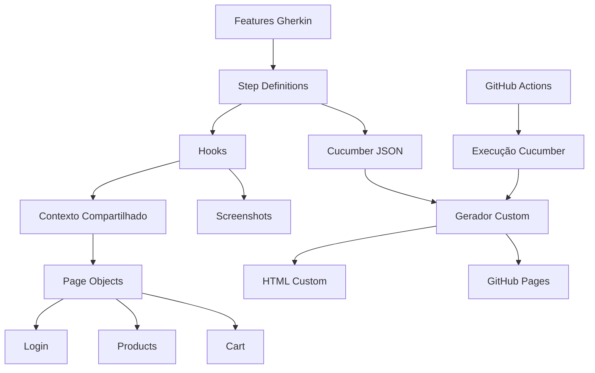

# 🚀 Automação E2E Web com Playwright + Cucumber

[](https://playwright.dev/)
[](https://www.typescriptlang.org/)
[](https://nodejs.org/)
[](https://rftrombeta.github.io/playwright-cucumber-e2e-testing/)

Projeto de automação E2E para o site [SauceDemo](https://www.saucedemo.com/), utilizando Cucumber (BDD), Playwright e arquitetura baseada em Page Objects.

> **📚 Documentação Completa de Testes**  
> Para estratégia, cobertura detalhada, comandos por tag e guia de contribuição, consulte **[TESTING.md](TESTING.md)**.

---

## 📋 Índice

- [Sobre o Projeto](#-sobre-o-projeto)
- [Tecnologias Utilizadas](#-tecnologias-utilizadas)
- [Arquitetura](#-arquitetura)
- [Pré-requisitos](#-pré-requisitos)
- [Instalação](#-instalação)
- [Execução dos Testes](#-execução-dos-testes)
- [Documentação dos Testes](#-documentação-dos-testes)
- [CI/CD](#-cicd---integração-contínua)
- [Estrutura do Projeto](#-estrutura-do-projeto)
- [Padrões Adotados](#-padrões-adotados)
- [Contribuindo](#-contribuindo)

---

## 📖 Sobre o Projeto

Este projeto implementa testes automatizados E2E da jornada web do SauceDemo, cobrindo fluxos de:

- ✅ Login (cenários positivos e negativos)
- ✅ Catálogo de produtos
- ✅ Carrinho e checkout
- ✅ Evidências por screenshot e relatório HTML customizado

---

## 🛠 Tecnologias Utilizadas

| Tecnologia | Versão | Descrição |
|------------|--------|-----------|
| [Playwright Test](https://playwright.dev/) | 1.49+ | Motor de automação web |
| [Cucumber](https://cucumber.io/) | 12.x | BDD com Gherkin e step definitions |
| [TypeScript](https://www.typescriptlang.org/) | 5.x | Tipagem estática e melhor manutenção |
| [cucumber-html-reporter](https://www.npmjs.com/package/cucumber-html-reporter) | 7.x | Geração de relatório customizado |

---

## 🏗 Arquitetura

O projeto segue uma arquitetura em camadas para separar responsabilidades:

```text
features/
├── *.feature                  # Cenários BDD em Gherkin
└── step_definitions/          # Implementação dos passos

support/
├── hooks.ts                   # Before/After/AfterStep
├── context.ts                 # Estado compartilhado
├── screenshot.ts              # Evidências e limpeza
└── pages/                     # Page Objects por domínio
	├── login/
	├── products/
	└── cart/

generate-report.js             # Relatório HTML customizado
.github/workflows/             # CI/CD e publicação no Pages
```



### Camadas

- **Features**: descrevem comportamento esperado em linguagem de negócio.
- **Step Definitions**: traduzem Gherkin em ações de automação.
- **Hooks**: controlam setup/teardown, screenshots e anexos.
- **Page Objects**: encapsulam seletores e ações reutilizáveis.
- **Relatórios**: consolidam resultados e evidências de execução.

---

## ✅ Pré-requisitos

Antes de começar, certifique-se de ter instalado:

- **Node.js** >= 18.x ([Download](https://nodejs.org/))
- **npm** >= 9.x
- **Git** ([Download](https://git-scm.com/))

---

## 📦 Instalação

1. **Clone o repositório**

```bash
git clone https://github.com/rftrombeta/playwright-cucumber-e2e-testing.git
cd playwright-cucumber-e2e-testing
```

2. **Instale as dependências**

```bash
npm install
```

3. **Instale os navegadores do Playwright**

```bash
npm run install-browsers
```

---

## ▶️ Execução dos Testes

### Comandos Básicos

```bash
# Executar todos os cenários Cucumber
npm run test:cucumber

# Gerar relatório customizado após execução
npm run report
```

### Filtro por tags

```bash
# Exemplo: apenas smoke
npm run test:cucumber:tag -- "@smoke"

# Exemplo: regressão positiva
npm run test:cucumber:tag -- "@regressao and @positivo"
```

> **💡 Mais comandos e padrões de tags**  
> Consulte **[TESTING.md](TESTING.md)**.

---

## 📖 Documentação dos Testes

Para informações detalhadas sobre estratégia, cobertura, padrões e inclusão de novos cenários:

### **[🧪 TESTING.md - Guia Completo de Testes](TESTING.md)**

---

## 🔄 CI/CD - Integração Contínua

O projeto possui **GitHub Actions** configurado para execução e publicação automática.

### Quando os testes executam

- ✅ A cada **push** na branch `main`
- ✅ Em **Pull Requests** para `main`
- ✅ Manualmente via **Run workflow**

### Como acessar resultados

- 🌐 Relatório online: https://rftrombeta.github.io/playwright-cucumber-e2e-testing/
- 📄 Workflow: [.github/workflows/e2e-reports.yml](.github/workflows/e2e-reports.yml)

---

## 📂 Estrutura do Projeto

```text
playwright-cucumber-e2e-testing/
├── features/
│   ├── 01-Login.feature
│   ├── 02-Produtos.feature
│   ├── 03-Cart.feature
│   └── step_definitions/
├── support/
│   ├── context.ts
│   ├── hooks.ts
│   ├── screenshot.ts
│   └── pages/
├── cucumber.js
├── generate-report.js
├── README.md
├── TESTING.md
└── REPORT.md
```

---

## 🎯 Padrões Adotados

- **BDD com Gherkin**: cenários legíveis e orientados ao negócio.
- **Page Object Pattern**: separação entre elementos e ações.
- **Tags Cucumber**: execução seletiva por tipo/suite/criticidade.
- **Nomenclatura em português**: cenários autoexplicativos.
- **Evidências automáticas**: screenshots e relatório HTML.

---

## 🤝 Contribuindo

Contribuições são bem-vindas.

1. Faça um **fork**
2. Crie uma branch (`git checkout -b feature/nova-feature`)
3. Faça commit (`git commit -m "feat: ..."`)
4. Envie para o fork (`git push origin feature/nova-feature`)
5. Abra um Pull Request

> **🔄 Testes automáticos**: ao abrir PR, o workflow executa automaticamente.

---

## 📄 Licença

Este projeto está sob a licença MIT. Consulte o arquivo [LICENSE](LICENSE) para mais detalhes.

---

## 👤 Autor

Desenvolvido por **[Rodrigo Trombeta](https://github.com/rftrombeta)**

[](https://www.linkedin.com/in/rodrigo-trombeta-21b89252/)
[](https://github.com/rftrombeta)

---

## 📞 Suporte

Encontrou algum problema ou tem sugestões? Abra uma issue:

- https://github.com/rftrombeta/playwright-cucumber-e2e-testing/issues

---

⭐ Se este projeto foi útil para você, considere deixar uma estrela no repositório.
